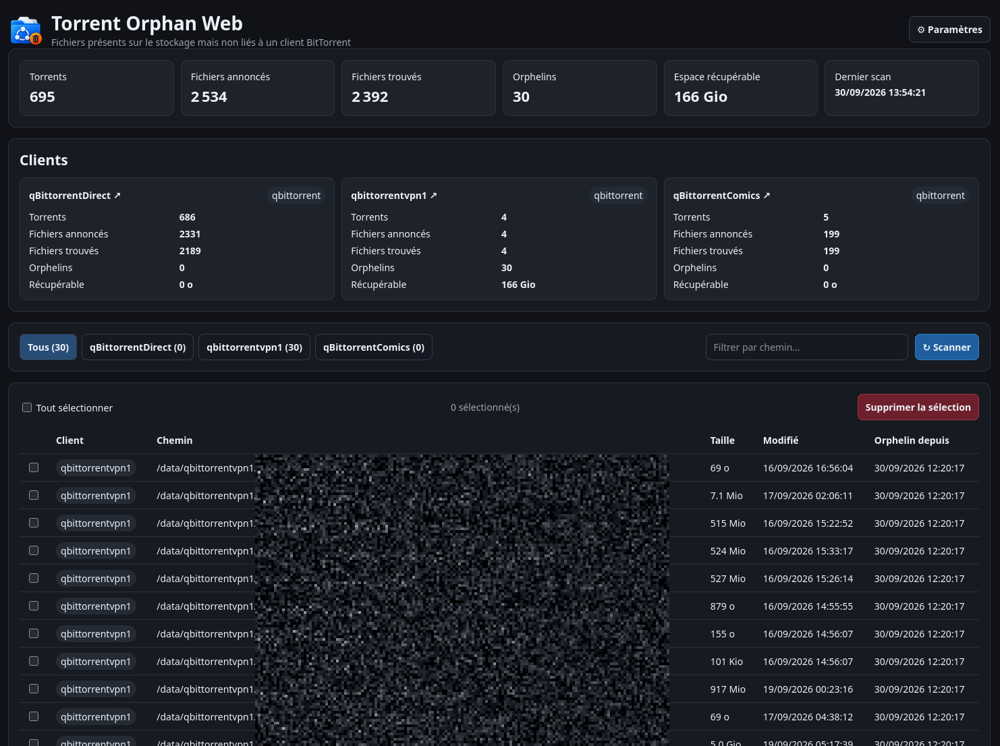
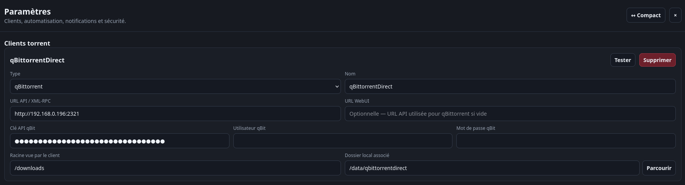
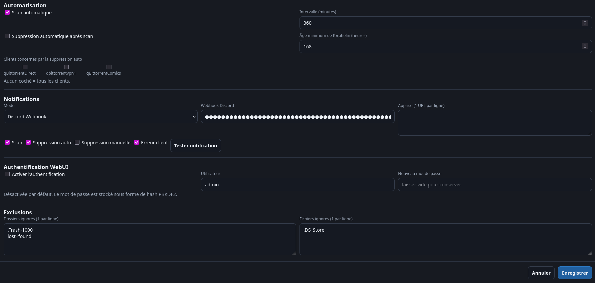

# Torrent Orphan Web

WebUI Docker légère pour repérer et supprimer les fichiers présents sur le stockage mais non liés à un client BitTorrent configuré.

## Aperçu

### Dashboard

Vue d’ensemble des clients BitTorrent, des fichiers annoncés et trouvés, des orphelins détectés et de l’espace récupérable.



### Configuration des clients

Chaque client peut être configuré avec son API, sa WebUI, sa racine distante et le dossier local associé.



### Automatisation, notifications et sécurité

Le panneau de configuration permet d’activer les scans automatiques, la suppression automatique optionnelle, les notifications Discord/Apprise et l’authentification WebUI.



## Fonctionnalités

- qBittorrent via WebAPI, avec clé API ou utilisateur/mot de passe ; compatible avec une WebUI alternative comme VueTorrent
- rTorrent via XML-RPC HTTP (`/RPC2` ou endpoint XML-RPC exposé par reverse proxy/ruTorrent)
- plusieurs clients avec un dossier local `/data/...` associé à chacun
- lien direct vers la WebUI de chaque client depuis son nom sur le dashboard
- navigateur de dossiers intégré, limité à `/data`
- prise en charge des chemins clients déjà exposés sous `/data` et des mappings depuis `/downloads`
- protection globale : un fichier référencé par n'importe quel client n'est jamais proposé comme orphelin
- filtrage et sélection des orphelins par client
- historique SQLite persistant dans `/config`
- statistiques par client et agrégées
- scan automatique configurable
- suppression automatique facultative après un âge minimum
- notifications Discord webhook ou Apprise
- authentification WebUI facultative, désactivée par défaut

## Lecture des statistiques

- **Torrents** : nombre de torrents déclarés par le client.
- **Fichiers annoncés** : nombre total de fichiers annoncés par l'API du client.
- **Fichiers trouvés** : nombre de fichiers annoncés réellement retrouvés sur le stockage après résolution des chemins.
- **Orphelins** : fichiers présents sur le stockage associé mais non liés à un client BitTorrent configuré.
- **Récupérable** : taille totale des fichiers orphelins.

## Docker

```yaml
services:
  qbit-orphan-web:
    image: ghcr.io/aerya/qbit-orphan-web:latest
    container_name: qbit-orphan-web
    ports:
      - "8188:8080"
    volumes:
      - ./config:/config
      - /mnt/torrent:/data:rw
    environment:
      - QOW_CONFIG_DIR=/config
      - QOW_BROWSE_ROOT=/data
    restart: unless-stopped
```

Tout le paramétrage applicatif se fait ensuite depuis la WebUI.

## Chemins et protection des fichiers

Un client peut annoncer des fichiers sous sa racine configurée, par exemple `/downloads`, ou directement sous `/data` lorsqu'il partage la même arborescence avec Torrent Orphan Web.

Les chemins sont résolus sous `/data`. Toute résolution qui sortirait de cette racine est rejetée. La liste globale des fichiers protégés est construite à partir de tous les clients avant le calcul des orphelins.

## rTorrent

Le connecteur utilise XML-RPC HTTP. Si rTorrent n'expose que SCGI brut, son endpoint XML-RPC peut être exposé via nginx/ruTorrent, souvent sous `/RPC2`. Flood ou ruTorrent peuvent continuer à être utilisés comme WebUI indépendamment.
